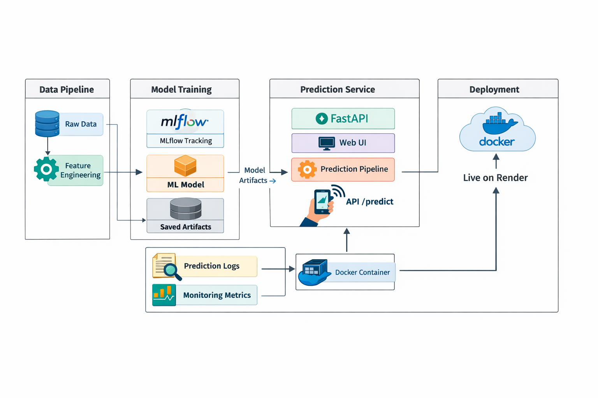

# Subscription Churn Prediction ML System
[Website - https://subscription-churn-ml-system.onrender.com]
## Project Overview 

This is an end-to-end machine learning system designed to predict customer churn in subscription-based businesses. The system leverages advanced machine learning techniques to identify customers at risk of canceling their subscriptions, enabling proactive retention strategies.

The application provides both a user-friendly web interface and RESTful API endpoints for making predictions on individual customers or batch processing via Excel files.

## Dataset

### Source
**Telco Customer Churn Dataset** (WA_Fn-UseC_-Telco-Customer-Churn.csv)

### Dataset Description
- **Total Records**: 7,043 customers
- **Features**: 20 input variables
- **Target Variable**: Churn (Yes/No)

### Key Features
- **Demographics**: Gender, SeniorCitizen, Partner, Dependents
- **Tenure**: Length of customer relationship (in months)
- **Services**: PhoneService, MultipleLines, InternetService, OnlineSecurity, OnlineBackup, DeviceProtection, TechSupport, StreamingTV, StreamingMovies
- **Account Info**: Contract type, PaperlessBilling, PaymentMethod
- **Charges**: MonthlyCharges, TotalCharges

### Data Location
```
data/
├── raw/
│   └── WA_Fn-UseC_-Telco-Customer-Churn.csv
└── processed/
    └── raw_loaded.csv
```


## Tech Stack

### Backend
- **Framework**: FastAPI - Modern Python web framework for building APIs
- **Server**: Uvicorn - ASGI web server
- **ORM/Data Processing**: Pandas, NumPy

### Machine Learning
- **Model Training**: scikit-learn 1.7.0
- **Gradient Boosting**: XGBoost
- **Data Preprocessing**: CustomPipeline with ColumnTransformer, StandardScaler, OneHotEncoder
- **Explainability**: SHAP (SHapley Additive exPlanations)
- **Experiment Tracking**: MLflow

### Frontend
- **Templates**: Jinja2
- **Styling**: Static CSS/JS
- **File Upload**: Excel support via openpyxl

### DevOps & Deployment
- **Containerization**: Docker
- **Orchestration**: Docker Compose
- **Deployment**: Render.com / Fly.io
- **Environment Management**: python-dotenv

### Configuration & Setup
- **Package Management**: pip, setuptools
- **Configuration**: PyYAML
- **Python Version**: 3.10

## Project Architecture

```
subscription-churn-ml-system/
├── app/                          # FastAPI application
│   ├── app.py                    # Main FastAPI app
│   └── prediction_api.py         # API routes
├── src/                          # ML pipeline source code
│   ├── components/               # ML components
│   │   ├── data_ingestion.py
│   │   ├── data_validation.py
│   │   ├── data_transformation.py
│   │   ├── feature_engineering.py
│   │   └── model_trainer.py
│   ├── pipeline/                 # ML pipelines
│   │   ├── train_pipeline.py
│   │   └── prediction_pipeline.py
│   ├── utils/                    # Utility functions
│   ├── logger.py                 # Logging configuration
│   ├── exception.py              # Custom exceptions
│   └── constants.py              # Configuration constants
├── templates/                    # HTML templates
│   ├── base.html
│   ├── index.html
│   └── result.html
├── static/                       # CSS, JS files
├── data/                         # Datasets
│   ├── raw/                      # Raw dataset
│   └── processed/                # Processed dataset
├── configs/                      # Configuration files
│   ├── config.yaml
│   └── training_config.yaml
├── artifacts/                    # Model artifacts
│   ├── models/
│   ├── features/
│   └── metrics/
├── notebooks/                    # EDA notebooks
│   └── EDA.ipynb
├── tests/                        # Unit tests
├── Dockerfile                    # Docker configuration
├── docker-compose.yml            # Docker Compose configuration
├── requirements.txt              # Python dependencies
├── pyproject.toml                # Project configuration
├── setup.py                      # Package setup
└── fly.toml                      # Fly.io configuration
```

### System Architecture Diagram



## Features

### 1. Web UI
- Interactive form for single customer prediction
- Real-time prediction results with churn probability
- Batch Excel file upload for multiple predictions
- Professional UI with error handling

### 2. REST API
- **POST `/predict-ui`** - Single prediction via web form
- **POST `/predict-excel`** - Batch predictions from Excel file
- **GET `/`** - Home page

### 3. ML Pipeline
- **Data Ingestion**: Load and validate data
- **Data Validation**: Quality checks and schema validation
- **Data Transformation**: Cleaning, encoding, scaling
- **Feature Engineering**: Feature extraction and selection
- **Model Training**: Multi-algorithm training with MLflow
- **Prediction**: Real-time inference with probability scores

## Model Details

### Algorithm
- **Primary Model**: Logistic Regression with preprocessing pipeline
- **Supporting Models**: XGBoost for comparison
- **Preprocessing**:
  - One-Hot Encoding for categorical features
  - Standard Scaling for numerical features
  - Column Transformer for multi-type feature handling

### Performance Metrics
- Stored in `artifacts/metrics/`
- Tracked via MLflow in `mlruns/`

## Installation & Setup

### Local Development

1. **Clone the repository**
```bash
git clone <repository-url>
cd subscription-churn-ml-system
```

2. **Create virtual environment**
```bash
python -m venv venv
./venv/Scripts/Activate  # Windows
source venv/bin/activate  # Linux/Mac
```

3. **Install dependencies**
```bash
pip install -r requirements.txt
```

4. **Set environment variables**
```bash
cp .env.example .env
# Edit .env with your configuration
```

5. **Run locally**
```bash
uvicorn app.app:app --reload
```

Access at `http://localhost:8000`

### Docker Deployment

1. **Build image**
```bash
docker build -t riyanozair/churn-ml-app .
```

2. **Run container**
```bash
docker run -p 8000:8000 riyanozair/churn-ml-app
```

3. **Using Docker Compose**
```bash
docker compose up --build
```

## Environment Variables

```env
PYTHON_ENV=production
HOST=0.0.0.0
PORT=8000
LOG_LEVEL=info
```

## Dependencies

Key packages:
- `fastapi==0.104.1` - Web framework
- `uvicorn[standard]==0.24.0` - ASGI server
- `scikit-learn==1.7.0` - ML algorithms
- `xgboost` - Gradient boosting
- `pandas` - Data manipulation
- `numpy` - Numerical computing
- `mlflow` - Experiment tracking
- `shap` - Model explainability
- `python-multipart` - Form data handling
- `openpyxl` - Excel file support
- `pyyaml` - Configuration files
- `python-dotenv` - Environment variables

See `requirements.txt` for complete list.

## Usage

### Single Prediction
1. Navigate to the web interface at `/`
2. Fill in customer information
3. Click "Predict"
4. View churn probability and prediction result

### Batch Prediction
1. Prepare an Excel file with customer data
2. Go to the batch upload section
3. Upload the file
4. Download results as CSV

### API Usage
```python
import requests

# Single prediction
response = requests.post(
    "http://localhost:8000/predict-ui",
    data={
        "gender": "Male",
        "SeniorCitizen": "0",
        "Partner": "Yes",
        # ... other fields
    }
)
result = response.json()
```

## Model Training

To retrain the model:

```bash
python src/pipeline/train_pipeline.py
```

This will:
1. Load and validate data
2. Transform features
3. Engineer new features
4. Train the model
5. Save artifacts to `artifacts/`
6. Log metrics to MLflow

## Project Structure Details

### Configuration
- `config.yaml` - General configuration
- `training_config.yaml` - Training parameters

### Logging
- All components use centralized logging via `src/logger.py`
- Logs capture both console and file output
- Error tracking via custom exceptions in `src/exception.py`

### MLflow Integration
- Experiment tracking in `mlruns/`
- Model versioning and comparison
- Metrics and parameters logged automatically

## Deployment

### Render.com
The application is configured for Render deployment with:
- Automatic Docker builds
- Environment variable management
- Health checks and auto-restart

### Fly.io
Alternative deployment using `fly.toml` configuration

## API Response Format

### Success Response
```json
{
  "prediction": "No",
  "churn_probability": 0.23
}
```

### Error Response
```json
{
  "error": "Invalid input data",
  "detail": "..."
}
```

## Monitoring & Logging

- Application logs in `logs/` directory
- MLflow UI: Run `mlflow ui` to visualize experiments
- Model artifacts stored in `artifacts/`

## Future Enhancements

- [ ] Advanced ensemble models
- [ ] Real-time monitoring dashboard
- [ ] Customer segmentation features
- [ ] A/B testing framework
- [ ] Real-time feature engineering
- [ ] Model explainability dashboard

## Contributing

1. Create a feature branch
2. Make your changes
3. Push to the branch
4. Create a Pull Request

## License

This project is licensed under the MIT License.

## Support

For issues and questions, please open an issue in the repository.

---

**Last Updated**: March 2026
**Status**: Production Ready
